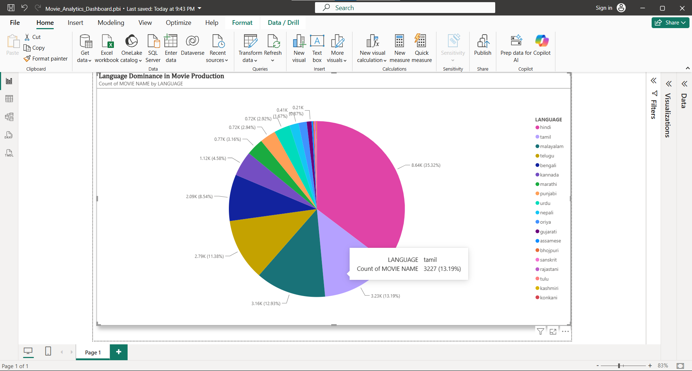

# Movie Analytics and Language Share Dashboard (Power BI)

## Project Overview
An interactive Power BI dashboard analyzing movie distribution, regional language volume, and key industry trends.

## Data Cleaning and ETL (Power Query)
Handled Missing Data:Addressed null and empty values using Power Query transformation strategies.
Data Preparation: Cleaned column types, trimmed whitespace, and filtered incomplete records to prepare data for visualization.

## Key Insights
**Hindi** leads movie production volume at **35.32%** (~8.64K movies).
**Tamil** (13.19%) and **Malayalam** (12.93%) follow as major regional contributors.

## Tools Used
**Power Query (ETL):** Data cleaning, missing value imputation, and type transformation.
**Power BI:** Data visualization, dynamic labeling, and metric aggregation.

## Dashboard Preview

